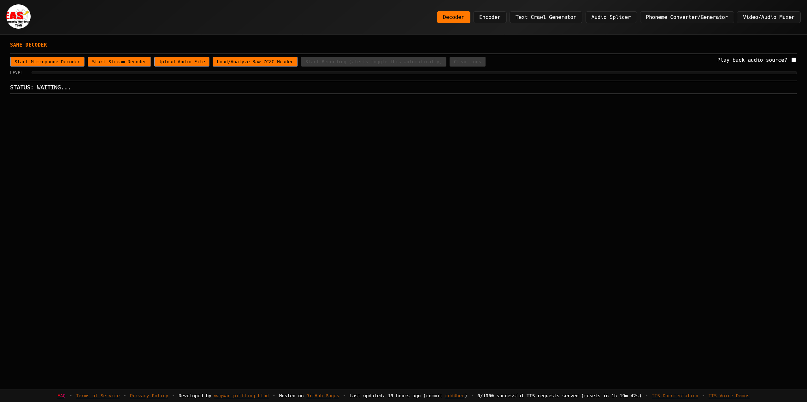

# Emergency Alert System (EAS)/Specific Area Message Encoding (SAME) Tools

[](./assets/eas-tools-logo.png)

Web‑based **EAS / SAME Tools** that run entirely in your browser. Packed to the brim with features, such as a full **decoder**, **encoder**, **text crawl generator**, **audio splicer**, **phoneme converter/generator**, and **video/audio muxer**. All tools are client‑side and work offline after the initial load. All open source and freely available on GitHub. Run your own copy if you'd like!

> ⚠️ **Legal & ethics notice**
> This project is for **lab, testing, hobbyist, and educational use only**. In many jurisdictions (e.g., U.S. FCC 47 CFR §11.45), transmitting or simulating EAS tones outside of authorized tests is prohibited. **Do not broadcast** generated tones or headers over public channels. The author is NOT responsible for ANY misuse of this software toolkit. You must also adhere to the EAS Tools [Terms of Service](https://eas.tools/terms.html) at all times when using the app.

---



---

## ✨ Features

* **Decoder**
  * Real‑time decoding of EAS/SAME headers from microphone input, or raw ZCZC‑formatted header input
  * File upload support for decoding prerecorded EAS audio
  * Visual audio meter for signal strength
  * Parsed header information: alert type, issuer, affected locations, issue/expiration times, sender ID, ENDEC used, and human‑readable text
* **Encoder**
  * Form‑based SAME header generation with validation
  * Text‑to‑speech synthesis of alert message (using WebAssembly voices/outside TTS service)
  * Downloadable WAV file of generated EAS audio (SAME tones + message)
* **Text Crawl Generator**
  * Create scrolling text crawl graphics for EAS alerts
  * Customize most aspects of the crawl appearance
  * Downloadable GIF/WEBM of generated text crawl
* **Audio Splicer**
  * Combine multiple custom audio samples into one continuous WAV file
  * Useful for creating custom audio without the use of programs like Audacity
  * Supports inserting silence between samples, trimming audio, splits, macros, and much more
* **Phoneme Converter/Generator**
  * Convert regular text into phoneme representations for use with TTS voices
  * Helps customize TTS pronunciations by providing phoneme output for specific words/phrases
  * Copy generated phonemes to clipboard for easy reuse
* **Video/Audio Muxer**
  * Combine video files with custom audio tracks using FFmpeg compiled to WebAssembly
  * Downloadable video file with new audio track

## Other highlights
* App is almost fully client‑side; runs entirely in your browser with no server backend (except for web TTS requests, if used)
* Works offline after initial load (service workers and all necessary assets included in initial load)
* Open source and freely available on GitHub (run your own copy if desired)

---

## 🚀 Quick start

### Run locally

1. **Clone** the repo:

   ```bash
   git clone https://github.com/wagwan-piffting-blud/EAS-Tools.git
   cd EAS-Tools
   ```
2. **Serve** it from `localhost` (recommended for microphone access):

   ```bash
   # Python 3
   python -m http.server 8080

   # or Node.js (install http-server if needed: `npm install -g http-server`)
   http-server -p 8080

   # then open http://localhost:8080 in your browser
   ```

   > Browsers require a **secure context** for microphone (`getUserMedia`). `https://` or `http://localhost:8080` works; opening `index.html` with a `file://` URL usually won’t.

---

## 🧭 Using the app

### Decoder

1. Go to **Decoder** tab
2. Choose your **microphone** (device selector) if multiple mics are available
3. Grant permission and select your microphone when prompted, or choose a direct audio stream or upload an audio file
4. (Optional) Enable **Play back this audio source?** checkbox to hear the audio through your speakers/headphones
5. Play an EAS/SAME tone; watch the meter & parsed headers
6. (Optional) Upload a prerecorded EAS audio file using the **Upload Audio File** button
7. (Optional) Click the **Load/Analyze Raw ZCZC Header** button to manually input a raw ZCZC‑formatted SAME header for parsing and display without audio input

What you’ll see:

* **Raw header** (e.g., `ZCZC-EAS-RMT...`)
* Parsed data about the alert (click "View Alert" to see full details):
  * **Severity**: "Warning", "Watch", "Advisory", "Test", etc.
  * **Type**: "Tornado Warning", "Required Weekly Test", etc.
  * **Issuer**: "National Weather Service", "Civil Authorities", etc.
  * **Affected Locations**: County names ("Douglas County", "Sarpy County", etc.)
  * **Issue Date**: Date & time of issuance
  * **Expires On**: Date & time of expiration
  * **Time until expiration**: "EXPIRED" if expired, or relative time of expiration
  * **Sender ID**: 8 character sender identifier (e.g., "KOAX/NWS")
  * **ENDEC Used**: The EAS ENDEC profile that the alert matches (e.g., "SAGE", "DIGITAL", "TRILITHIC", etc., best guess based on the header structure and content)
  * **Human-Readable Alert Text**: The message associated with the alert, parsed using a JS port of [EAS2Text](https://github.com/Newton-Communications/E2T/)
  * **Open in SAME Encoder**: Button to copy the header into the Encoder tool form for easy regeneration of the same exact alert
  * **Color-coding** of the alert modal for quick visual identification of severity (e.g., red border for "Warning" or "Emergency" alerts that are not tests or demos)

### Encoder

1. Go to **Encoder** tab
2. Fill out the form fields (or paste an existing header in the **Use custom SAME Header** box)
3. (Optional) Enter a message for TTS voice synthesis
4. Click **Generate**
5. (Optional) Click play on the audio control to listen in‑browser
6. (Optional) Click **Save as wav file** to save the generated EAS audio file

### Text Crawl Generator

1. Go to **Text Crawl Generator** tab and choose a **Select Crawl Text Source** mode. Keep **Custom Text** to type a message directly or pick **Generate from EAS Header using EAS2Text** to auto-build the crawl from a raw SAME header
2. Provide the content for the mode you picked:
   * **Custom Text**: Enter any crawl copy in the multiline box
   * **EAS2Text**: Paste the raw header, then decide whether to use the local timezone, override it manually, and optionally emulate a specific ENDEC profile for text phrasing
3. Dial in **Crawl Settings** to match the target look:
   * Speed, VDS mode, and frame delay control motion cadence
   * Font family/style/size, canvas width & height, inset, restart delay, and the background/text/outline colors let you mimic different station styles
4. Use the control buttons to run or export the crawl:
   * **Start/Pause/Stop** handle playback; output appears live in the preview bar and is summarized in the status line
   * **Export as GIF** or **Export as video (.webm)** capture the crawl, while **Copy Crawl Text** copies the resolved crawl text for reuse

### Audio Splicer

1. Go to **Audio Splicer** tab
2. Upload multiple audio samples or synthesize new TTS samples using the TTS section inside the Splicer
3. Modify the order of the samples as needed, and optionally customize options to your liking (e.g., add silence between samples, trim audio, apply macros, etc.)
4. Click **Export WAV** to create a single continuous WAV file for download

### Phoneme Converter/Generator
1. Go to **Phoneme Converter/Generator** tab
2. Enter the text you wish to convert into phonemes in the provided text area
3. Click the **Convert** button to generate the phoneme representation of the text
4. The generated phonemes will be displayed in the output section below the button
5. You can then copy the generated phonemes to your clipboard for use with the Web TTS service or your own local copy of whatever TTS voice(s) you have available

### Video/Audio Muxer (combiner)

1. Go to **Video/Audio Muxer** tab
2. Load FFmpeg.wasm by clicking the **Load FFmpeg** button (only needs to be done once per session)
3. Upload video and audio files to combine
4. Click **Append audio to video** to create the combined file
5. Download your new video with the added audio track

### Navigation

Use the tabs at the top of the page to switch between the various available tools. You can also link to a specific tab using URL parameters:
* `?tool=decoder` – Opens the **Decoder** tab
* `?tool=encoder` – Opens the **Encoder** tab
* `?tool=crawl` – Opens the **Text Crawl Generator** tab
* `?tool=splicer` – Opens the **Audio Splicer** tab
* `?tool=phoneme` – Opens the **Phoneme Converter/Generator** tab
* `?tool=muxer` – Opens the **Video/Audio Muxer** tab

### Documentation

For more detailed documentation on the TTS feature, see the [TTS docs page](https://eas.tools/tts-docs.html).

If you need help coming up with phonemes/pronunciations for the TTS voice of your choosing, and the built-in phoneme generator is inaccurate, check out the [TTS Phoneme Helper GPT](https://chatgpt.com/g/g-6919e0f83e4c8191b57400362668981c-tts-phoneme-helper) powered by ChatGPT **(NOTE: Requires a free OpenAI account to use)**.

For a demonstration of each individual TTS voice, see the [voice demo page](https://eas.tools/demos.html).

---

## 📜 Credits & third‑party

* UI fonts: **Hack** (via `assets/css/hack.css`)
* WAV writer: **wavefile.js** (bundled in `assets/js/wavefile.js`)
* Resampling: **wave‑resampler.js** (bundled in `assets/js/wave‑resampler.js`)
* gif.js: **gif.js** (bundled in `assets/js/gif.js`)
* WebAssembly TTS voice: **piper.tts.js** (bundled in `assets/piper-tts/piper-tts-bundle.js` and `assets/piper-tts/`) and **nanotts.js** (bundled in `assets/js/nanotts.js` and `assets/nanotts/`)
* CodeMirror: **CodeMirror** (bundled in `assets/js/codemirror.js` and related CSS files in `assets/css/`)
* EAS2Text: **EAS2Text** JS port by wagwan-piffting-blud (originally by Newton Communications)
* SoX-EMScripten: **sox-emscripten** (bundled in `assets/js/sox.js` and `assets/js/sox.wasm`)
* coi-serviceworker.js: **coi-serviceworker.js** (bundled in `coi-serviceworker.js`, MUST be hosted at root of site to work!)
* canvas-capture.js: **canvas-capture.js** (bundled in `assets/js/canvas-capture.js`)
* ffmpeg.wasm: **ffmpeg.wasm** (bundled in `assets/muxer`, built with WebPack)
* phonemeize: **phoneme-bundle.js** and assorted files in `assets/js/` that are prefixed with `phoneme-` (WebPack bundled from [phonemeize](https://github.com/hans00/phonemize) NPM package with some custom modifications/additions for Web TTS use)
* SAME decoding/encoding logic: Original code by CryptoDude3 (removed GitHub Pages site), maintained and expanded by wagwan-piffting-blud; with credit to EAS.js (by [GWES](https://globaleas.org/)) for reference implementation for specific ENDEC profiles for both decoder and encoder logic

* Inspiration / references:
  * [nicksmadscience SAME Encoder, Python](https://github.com/nicksmadscience/eas-same-encoder)
  * [Mab879 C++ SAME Encoder](https://github.com/Mab879/eas_encoder)
  * Anon64 EAS Header Generator (removed)
  * [wavefile.js](https://rochars.github.io/wavefile/)
  * [wave‑resampler.js](https://github.com/rochars/wave-resampler)
  * [piper.tts.js](https://github.com/Mintplex-Labs/piper-tts-web)
  * [gif.js](https://github.com/jnordberg/gif.js)
  * [codemirror.js](https://codemirror.net/)
  * [EAS2Text](https://github.com/Newton-Communications/E2T/)
  * [sox-emscripten](https://github.com/rameshvarun/sox-emscripten)
  * [coi-serviceworker.js](https://github.com/gzuidhof/coi-serviceworker)
  * [canvas-capture.js](https://github.com/amandaghassaei/canvas-capture)
  * [ffmpeg.wasm](https://github.com/ffmpegwasm/ffmpeg.wasm)
  * [phonemeize](https://github.com/hans00/phonemize)
  * [EAS.js](https://github.com/globaleas/EAS.js/)
  * CryptoDude3 GitHub Pages site (removed) for most of the original code (encoder/decoder logic) and current page looks

> See each upstream project for their respective licenses.

---

## 🛡️ License

This project is licensed under **GPL‑3.0** (see [`LICENSE`](./LICENSE)).

---

## 📍 Disclaimers

This tool decodes and synthesizes EAS/SAME signals for **lab, testing, hobbyist, and educational** purposes only. You are responsible for complying with all laws, regulations, and organizational policies applicable to your use. The author is NOT responsible for ANY misuse of this software toolkit. You must also adhere to the EAS Tools [Terms of Service](https://eas.tools/terms.html) at all times when using the app.

## GenAI Disclosure Notice: Portions of this repository have been generated using Generative AI tools (ChatGPT, ChatGPT Codex, GitHub Copilot).
